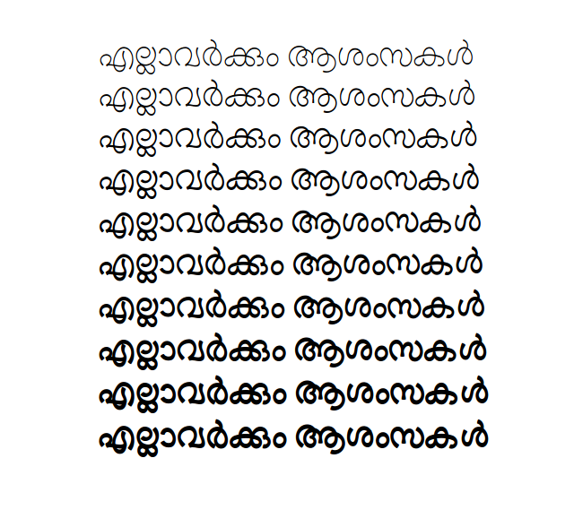
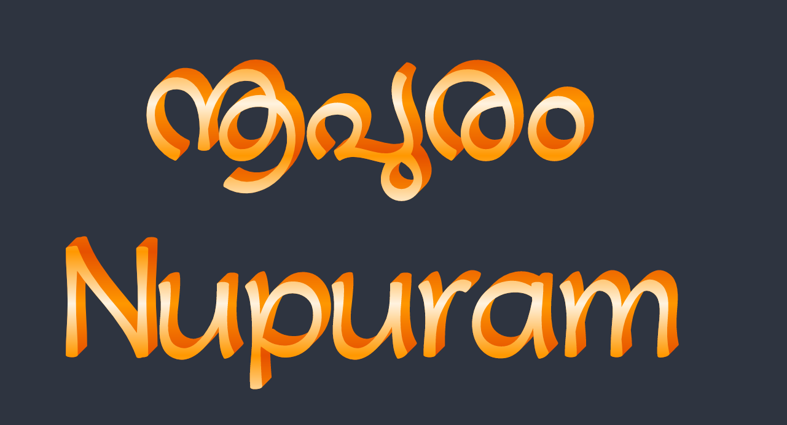
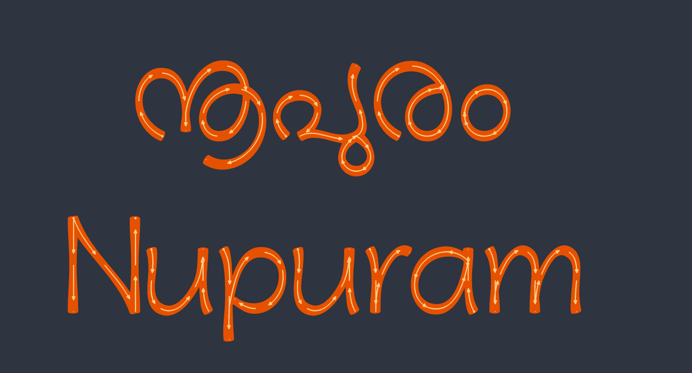
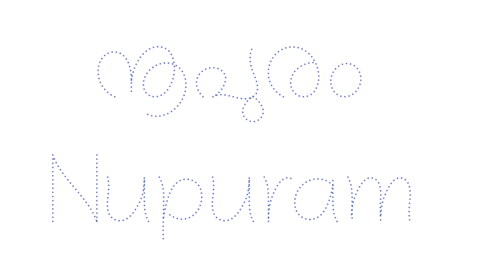
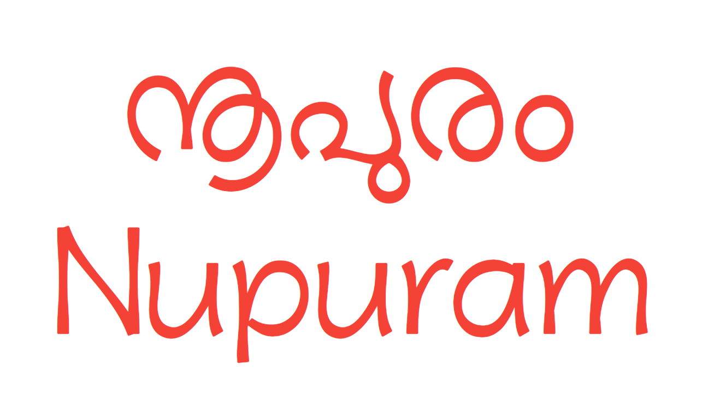
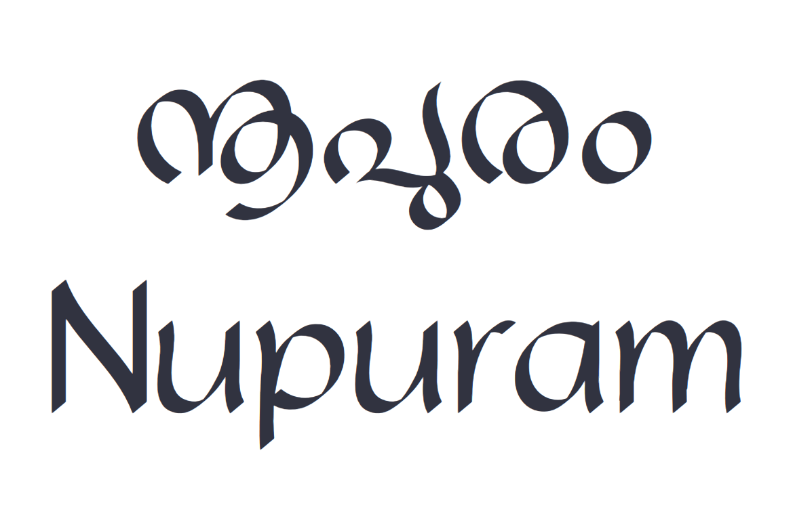

# Nupuram Malayalam Typeface

A Malayalam typeface, inspired from the early Malayalam movie titles designs. The curves are fluid, bold and expressive.

Taking full advantage of variable font technology, Nupuram offers an unprecedented level of flexibility, all from a single font file. Nupuram has 4 variable axes: `Weight`, `Width`, `Slant` and `Softness`.

As a variable font, Nupuram gives you fine-grained control over each one of its styles. However, it also comes with 64 predefined styles that are easy to access through your font menu. Called *named instances¹*, these work just like regular static fonts do.

¹ *Named instance*: a predetermined location in the designspace of a variable font, similar to the "static instances" that are familiar in traditional digital fonts.

The Variable font capability makes Nupuram stylistically flexible and warmly energetic.

Nupuram is also available as multiple fonts with different weights.

## Nupuram Color

Nupuram also has a Color font version with COLRv1 specification. The colors can be customized, for example using CSS.

## Nupuram Arrows

For educational purposes, to learn the pen movement for writing a letter, Nupuram comes with a variant named Nupuram Arrows. This is a Color font.

## Nupuram Dots

Agian, for educational purposes, to practice in worksheets, Nupuram comes with a variant named Nupuram Dots.

## Nupuram Display

Nupuram Display is a Display typeface to use with large point sizes. Its terminals are flat with rounded corners and has optimized xheight for large sizes.

## Nupuram Calligraphy

Nupuram Calligraphy simulates a wide nib Calligraphy pen.

## Language support

39 languages: Afrikaans, Albanian, Basque, Bosnian, Catalan, Croatian, Czech, Danish, Dutch, English, Estonian, Faroese, Filipino, Finnish, French, Galician, German, Hungarian, Icelandic, Indonesian, Irish, Italian, Latvian, Lithuanian, Malay, Malayalam, Norwegian Bokmål, Polish, Portuguese, Romanian, Slovak, Slovenian, Spanish, Swahili, Swedish, Tongan, Turkish, Welsh and Zulu

## License

This Font Software is licensed under the SIL Open Font License, Version 1.1. This licens is available with a FAQ at: https://scripts.sil.org/OFL
