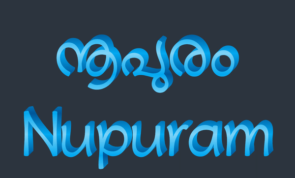

# Nupuram Malayalam Typeface

A Malayalam typeface, inspired from the early Malayalam movie titles designs. The curves are fluid, bold and expressive.

**Download**: Latest versions can be downloaded from [smc.org.in/fonts/nupuram](https://smc.org.in/fonts/nupuram)

Taking full advantage of variable font technology, Nupuram offers an unprecedented level of flexibility, all from a single font file. Nupuram has 4 variable axes: `Weight`, `Width`, `Slant` and `Softness`.

As a variable font, Nupuram gives you fine-grained control over each one of its styles. However, it also comes with 64 predefined styles that are easy to access through your font menu. Called *named instances¹*, these work just like regular static fonts do.

¹ *Named instance*: a predetermined location in the designspace of a variable font, similar to the "static instances" that are familiar in traditional digital fonts.

The Variable font capability makes Nupuram stylistically flexible and warmly energetic.


Nupuram is also available as multiple fonts with different weights.


## Variation axes

Nupuram has the following axes:

| Axis       | Tag    | Range        | Default | Description                                                     |
| ---------- | ------ | ------------ | ------- | --------------------------------------------------------------- |
| Weight  | `wght` | 100 to 900       | 400       | Thin to Black. Can be defined with usual font-weight property.                      |
| Slant     | `slnt` | -15 to 0       | 0       | Upright (0°) to Slanted (about 15°)                                                |
| Width     | `wdth` | 75 to 125  | 100     | Condensed to Expanded. Can be defined with usual font-stretch property. |
| Soft      | `SOFT` | 0 to 100     | 50       | Sharp to normal to SuperSoft terminals                           |

### Axis Definitions

* **Weight** `wght`: 100 to 900. The overall thickness of letters and the darkness of text composed with them.

    Recommended use: Differences in weight can provide emphasis in text, show user interaction, or adjust the tone of communication. For light text on dark backgrounds, 400 (“Regular”) tends to be appropriate for text and code. For dark text on a light background, it can be beneficial to adjust the weight upwards to 500 (“Medium”).

* **Slant** `slnt`: 0 to -15. The "forward lean" of letters. Note: -15 (negative 15) corresponds to a 15° clockwise slant, due to type design's roots in geometry.

    Recommended use: The Malayalam script with its glyph characteristics does not have an established slant behavior. Mostly we mimic the slanting in latin. And we often call italic. Note that italic and slant are not same.  Use Slant as a secondary way to emphasize text or vary typographic tone. In text, it can be useful to use a partial slant of around -12.

* **Width** `wdth`: 75 to 125%. The percentage of letter width. 75% is 'Condensed', where the letters are horizontally condensed to 75% of original width. 125% is 'Expanded' where the letters are horizontally stretched to 125% of original width.

    Recommended use: The condense or expand can be used to achieve precise typographic layout in a predefined rendering space. The content can be adjusted in this way to "fit" the space. Be aware of the legibility degradation when doing this.

* **Soft** `SOFT`: 0 to 100. The terminals of the letters of Nupuram are slightly rounded by default. This is also known as Soft terminals. To make the terminal sharp - sharp cuts at ends, use 'Sharp' value 0. To make the terminals more rounded using a higher value. Using a value 100 means, the terminals are half circles with diameter equals the terminal width.

    Recommended use: Roundness or Sharpness at terminals can help change the tone of communication, say from mechanical to human, from formal to informal.

## Nupuram Color

Nupuram also has a Color font version with COLRv1 specification. The colors can be customized, for example using CSS. For applications that does not support COLRv1 spec, there is a COLRv0 variant as well. Support for Color fonts vary a lot across applications, please [refer this site](https://www.colorfonts.wtf/) for a detailed reading. Google Chrome and related browsers [support COLRv1 in their latest versions](https://developer.chrome.com/blog/colrv1-fonts/).

Nupuram Color is also a variable font. The weight axis changes the offset in z-axis.

| Axis       | Tag    | Range        | Default | Description                                                     |
| ---------- | ------ | ------------ | ------- | --------------------------------------------------------------- |
| Weight  | `wght` | 100 to 900       | 400       | Thin to Black. Can be defined with usual font-weight property.                      |



Nupuram Color font gives 18 predefined pallettes that can be selected by users. Or a user can specify the colors using CSS for example.

This color font uses 3 colors for its shadow-ish look. They are Dark, Light, Base colors. Base is the facing color, Light is the central glowing area color. Dark is the color for the shadow part. The colors are used to create a gradient internally.

The following CSS customizes the pallette to give a rendering given below:

```css
.content {
  font-family: 'NupuramColor';
  font-palette: --custom;
}

@font-palette-values --custom  {
  font-family: 'NupuramColor';
  /* Change this to a value between 0 and 18 to chose a supplied palette. */
  base-palette: 0;
  /* Or provide the colors directly to override palette */
  override-colors: 0 #FFD700, 1 #FFD700, 2 #1E0303;
}
```


You may try the color selector provided in the [Nupuram font playground](https://smc.gitlab.io/fonts/Nupuram/tests/).
If you want to create a new font with the provided colors, there is a tool called [DJR's Color Font Customizer](https://tools.djr.com/color-font-customizer/).

## Nupuram Arrows

For educational purposes, to learn the pen movement for writing a letter, Nupuram comes with a variant named Nupuram Arrows. This is a Color font.


## Nupuram Dots

Again, for educational purposes, to practice in worksheets, Nupuram comes with a variant named Nupuram Dots.


## Nupuram Display

Nupuram Display is a Display typeface to use with large point sizes. Its terminals are flat with rounded corners and has optimized xheight for large sizes.


## Nupuram Calligraphy

Nupuram Calligraphy simulates a wide nib Calligraphy pen with nib rotation at 40°. This is a variable font with weight axis. The width of the calligraphy pen can be varied for getting different weights.


| Axis       | Tag    | Range        | Default | Description                                                     |
| ---------- | ------ | ------------ | ------- | --------------------------------------------------------------- |
| Weight  | `wght` | 100 to 900       | 400       | Thin to Black. Can be defined with usual font-weight property.                      |

## Using the fonts

* Download the latest fonts from the [Releases](https://gitlab.com/smc/fonts/Nupuram/-/releases/) (Look under the "Assets" of the latest release, download the zip, and then open that zip)
* Install the fonts on your system. Depending on the Operating system, the installation steps vary. In general, Clicking on the font file give the option to install it.

### Using Variable font in web pages

Varibale fonts save bandwith in web pages by having a single font to download, while providing all style variations. Using them on webpages is a big topic. Please use a [good tutorial like MDN](https://developer.mozilla.org/en-US/docs/images/Web/CSS/CSS_Fonts/Variable_Fonts_Guide)

In general, you should link in the font with @font-face

```css
@font-face {
 font-family: 'Nupuram';
 src: url('path/to/font/Nupuram-VF.woff2') format('woff2-variations');
 font-weight: 100 900;
 font-stretch: 75% 125%;
 font-style: oblique 0deg 15deg;
}
```

Then, you can use the font with both `font-weight` and `font-variation-settings`. Using CSS [custom properties will help](https://pixelambacht.nl/2019/fixing-variable-font-inheritance/) to avoid some caveats of property inheritance.

### Using Color fonts in web

Since latest Chrome and Firefox browsers support COLRv1 spec which allows customization of pallettes and color gradients and all other browser does not support it, we need to use some feature support testing in CSS.

```css
/* Old browsers and Safari - use Colrv0 */
@supports not (font-palette: --custom) {
  @font-face {
    font-family: "NupuramShadowColor";
    src: url(../fonts/webfonts/Nupuram-Color-v0.woff2) format("woff2");
  }
}
/* Latest browsers - Use colrv1 */
@supports (font-palette: --custom) {
  @font-face {
    font-family: "NupuramShadowColor";
    src: url(../path/to/Nupuram-Color-v1.woff2) format("woff2");
  }
}
```

## Building the fonts

Install the required software packages, assuming a debian based GNU/Linux Operating system

```bash
apt-get update -y
apt-get install -y make python3-pip python3-venv python3-yaml texlive-metapost libharfbuzz-bin
```

To build, set up the virtual environment and activate it.

```bash
virtualenv -p python3 venv
source venv/bin/activate
```

Then install requirements:

```bash
pip install -U -r requirements.txt
```

Then run make to build everything

```bash
make
```

This will take more than 15 minutes to build everything. But if you have a multi core processor, you can speed up this by using parallel build. Assuming you have 8 core system(8 CPUs)

```
make -j8
```

## Language support

All the Malayalam characters defined in Unicode version 15 are present in the font. Nupuram also has latin script support. Nupuram supports 294 languages convering approximately 2.8B speakers(Calculated using [hyperglot tool](https://hyperglot.rosettatype.com/))

<details>
  <summary><strong>Supported languages</strong></summary>
  <ul>
    <li> Acheron </li>
    <li> Achinese </li>
    <li> Acholi </li>
    <li> Afar </li>
    <li> Afrikaans </li>
    <li> Alekano </li>
    <li> Aleut </li>
    <li> Amahuaca </li>
    <li> Amarakaeri </li>
    <li> Amis </li>
    <li> Anaang </li>
    <li> Andaandi, Dongolawi </li>
    <li> Anuta </li>
    <li> Ao Naga </li>
    <li> Aragonese </li>
    <li> Arbëreshë Albanian </li>
    <li> Arvanitika Albanian </li>
    <li> Asháninka </li>
    <li> Ashéninka Perené </li>
    <li> Asu (Tanzania) </li>
    <li> Balinese </li>
    <li> Bari </li>
    <li> Basque </li>
    <li> Batak Dairi </li>
    <li> Batak Karo </li>
    <li> Batak Mandailing </li>
    <li> Batak Simalungun </li>
    <li> Batak Toba </li>
    <li> Bemba (Zambia) </li>
    <li> Bena (Tanzania) </li>
    <li> Bikol </li>
    <li> Bislama </li>
    <li> Borana-Arsi-Guji Oromo </li>
    <li> Bosnian </li>
    <li> Breton </li>
    <li> Buginese </li>
    <li> Candoshi-Shapra </li>
    <li> Caquinte </li>
    <li> Caribbean Hindustani </li>
    <li> Cashibo-Cacataibo </li>
    <li> Catalan </li>
    <li> Cebuano </li>
    <li> Central Aymara </li>
    <li> Central Kurdish </li>
    <li> Chamorro </li>
    <li> Chavacano </li>
    <li> Chiga </li>
    <li> Chiltepec Chinantec </li>
    <li> Chokwe </li>
    <li> Chuukese </li>
    <li> Cimbrian </li>
    <li> Cofán </li>
    <li> Congo Swahili </li>
    <li> Cook Islands Māori </li>
    <li> Cornish </li>
    <li> Corsican </li>
    <li> Creek </li>
    <li> Crimean Tatar </li>
    <li> Croatian </li>
    <li> Czech </li>
    <li> Danish </li>
    <li> Dehu </li>
    <li> Dutch </li>
    <li> Eastern Abnaki </li>
    <li> Eastern Arrernte </li>
    <li> Eastern Oromo </li>
    <li> Embu </li>
    <li> English </li>
    <li> Ese Ejja </li>
    <li> Faroese </li>
    <li> Fijian </li>
    <li> Filipino </li>
    <li> Finnish </li>
    <li> French </li>
    <li> Friulian </li>
    <li> Galician </li>
    <li> Ganda </li>
    <li> Garifuna </li>
    <li> Ga’anda </li>
    <li> German </li>
    <li> Gheg Albanian </li>
    <li> Gilbertese </li>
    <li> Gooniyandi </li>
    <li> Gourmanchéma </li>
    <li> Guadeloupean Creole French </li>
    <li> Gusii </li>
    <li> Haitian </li>
    <li> Hani </li>
    <li> Hawaiian </li>
    <li> Hiligaynon </li>
    <li> Ho-Chunk </li>
    <li> Hopi </li>
    <li> Huastec </li>
    <li> Hungarian </li>
    <li> Hän </li>
    <li> Icelandic </li>
    <li> Iloko </li>
    <li> Inari Sami </li>
    <li> Indonesian </li>
    <li> Irish </li>
    <li> Istro Romanian </li>
    <li> Italian </li>
    <li> Ixcatlán Mazatec </li>
    <li> Jamaican Creole English </li>
    <li> Japanese </li>
    <li> Javanese </li>
    <li> Jola-Fonyi </li>
    <li> K'iche' </li>
    <li> Kabuverdianu </li>
    <li> Kalaallisut </li>
    <li> Kalenjin </li>
    <li> Kamba (Kenya) </li>
    <li> Kaonde </li>
    <li> Karelian </li>
    <li> Kashubian </li>
    <li> Kekchí </li>
    <li> Kenzi, Mattokki </li>
    <li> Khasi </li>
    <li> Kikuyu </li>
    <li> Kimbundu </li>
    <li> Kinyarwanda </li>
    <li> Kituba (DRC) </li>
    <li> Kongo </li>
    <li> Konzo </li>
    <li> Kuanyama </li>
    <li> Kven Finnish </li>
    <li> Kölsch </li>
    <li> Ladin </li>
    <li> Ladino </li>
    <li> Latgalian </li>
    <li> Latin </li>
    <li> Ligurian </li>
    <li> Lithuanian </li>
    <li> Lombard </li>
    <li> Low German </li>
    <li> Lower Sorbian </li>
    <li> Luba-Lulua </li>
    <li> Lule Sami </li>
    <li> Luo (Kenya and Tanzania) </li>
    <li> Luxembourgish </li>
    <li> Macedo-Romanian </li>
    <li> Makhuwa </li>
    <li> Makhuwa-Meetto </li>
    <li> Makonde </li>
    <li> Makwe </li>
    <li> Malagasy </li>
    <li> Malaysian </li>
    <li> Maltese </li>
    <li> Mandinka </li>
    <li> Manx </li>
    <li> Maore Comorian </li>
    <li> Maori </li>
    <li> Mapudungun </li>
    <li> Marshallese </li>
    <li> Matsés </li>
    <li> Mauritian Creole </li>
    <li> Meriam Mir </li>
    <li> Meru </li>
    <li> Minangkabau </li>
    <li> Mirandese </li>
    <li> Mohawk </li>
    <li> Montenegrin </li>
    <li> Munsee </li>
    <li> Murrinh-Patha </li>
    <li> Mwani </li>
    <li> Mískito </li>
    <li> Naga Pidgin </li>
    <li> Ndonga </li>
    <li> Neapolitan </li>
    <li> Ngazidja Comorian </li>
    <li> Niuean </li>
    <li> Nobiin </li>
    <li> Nomatsiguenga </li>
    <li> North Marquesan </li>
    <li> North Ndebele </li>
    <li> Northern Kurdish </li>
    <li> Northern Qiandong Miao </li>
    <li> Northern Uzbek </li>
    <li> Norwegian </li>
    <li> Nyanja </li>
    <li> Nyankole </li>
    <li> Occitan </li>
    <li> Ojitlán Chinantec </li>
    <li> Orma </li>
    <li> Oroqen </li>
    <li> Palauan </li>
    <li> Paluan </li>
    <li> Pampanga </li>
    <li> Papantla Totonac </li>
    <li> Papiamento </li>
    <li> Pedi </li>
    <li> Picard </li>
    <li> Pichis Ashéninka </li>
    <li> Piemontese </li>
    <li> Pijin </li>
    <li> Pintupi-Luritja </li>
    <li> Pipil </li>
    <li> Pohnpeian </li>
    <li> Polish </li>
    <li> Portuguese </li>
    <li> Potawatomi </li>
    <li> Purepecha </li>
    <li> Quechua </li>
    <li> Romanian </li>
    <li> Romansh </li>
    <li> Rotokas </li>
    <li> Rundi </li>
    <li> Rwa </li>
    <li> Samburu </li>
    <li> Samoan </li>
    <li> Sango </li>
    <li> Sangu (Tanzania) </li>
    <li> Saramaccan </li>
    <li> Sardinian </li>
    <li> Scottish Gaelic </li>
    <li> Sena </li>
    <li> Seri </li>
    <li> Seselwa Creole French </li>
    <li> Shambala </li>
    <li> Shawnee </li>
    <li> Shipibo-Conibo </li>
    <li> Shona </li>
    <li> Sicilian </li>
    <li> Silesian </li>
    <li> Slovak </li>
    <li> Slovenian </li>
    <li> Soga </li>
    <li> Somali </li>
    <li> Soninke </li>
    <li> South Marquesan </li>
    <li> South Ndebele </li>
    <li> Southern Aymara </li>
    <li> Southern Qiandong Miao </li>
    <li> Southern Sami </li>
    <li> Southern Sotho </li>
    <li> Spanish </li>
    <li> Sranan Tongo </li>
    <li> Standard Estonian </li>
    <li> Standard Latvian </li>
    <li> Standard Malay </li>
    <li> Sundanese </li>
    <li> Swahili </li>
    <li> Swati </li>
    <li> Swedish </li>
    <li> Swiss German </li>
    <li> Tagalog </li>
    <li> Tahitian </li>
    <li> Taita </li>
    <li> Tedim Chin </li>
    <li> Tetum </li>
    <li> Tetun Dili </li>
    <li> Tiv </li>
    <li> Tok Pisin </li>
    <li> Tokelau </li>
    <li> Tonga (Tonga Islands) </li>
    <li> Tonga (Zambia) </li>
    <li> Tosk Albanian </li>
    <li> Tsonga </li>
    <li> Tswana </li>
    <li> Tumbuka </li>
    <li> Turkish </li>
    <li> Turkmen </li>
    <li> Tzeltal </li>
    <li> Tzotzil </li>
    <li> Uab Meto </li>
    <li> Upper Guinea Crioulo </li>
    <li> Upper Sorbian </li>
    <li> Venetian </li>
    <li> Veps </li>
    <li> Võro </li>
    <li> Wallisian </li>
    <li> Walloon </li>
    <li> Walser </li>
    <li> Wangaaybuwan-Ngiyambaa </li>
    <li> Waray (Philippines) </li>
    <li> Warlpiri </li>
    <li> Wayuu </li>
    <li> Welsh </li>
    <li> West Central Oromo </li>
    <li> Western Abnaki </li>
    <li> Western Frisian </li>
    <li> Wik-Mungkan </li>
    <li> Wiradjuri </li>
    <li> Wolof </li>
    <li> Xhosa </li>
    <li> Yanesha' </li>
    <li> Yao </li>
    <li> Yapese </li>
    <li> Yindjibarndi </li>
    <li> Yucateco </li>
    <li> Zapotec </li>
    <li> Zulu </li>
    <li> Záparo </li>
</ul>
</details>


## Credits

See [FONTLOG.md](FONTLOG.md) for details on contributions.

## Contributing

See [CONTRIBUTING.md](CONTRIBUTING.md) for policies around contributing to the project.

## License

This Font Software is licensed under the SIL Open Font License, Version 1.1. This license is available with a FAQ at: https://scripts.sil.org/OFL
